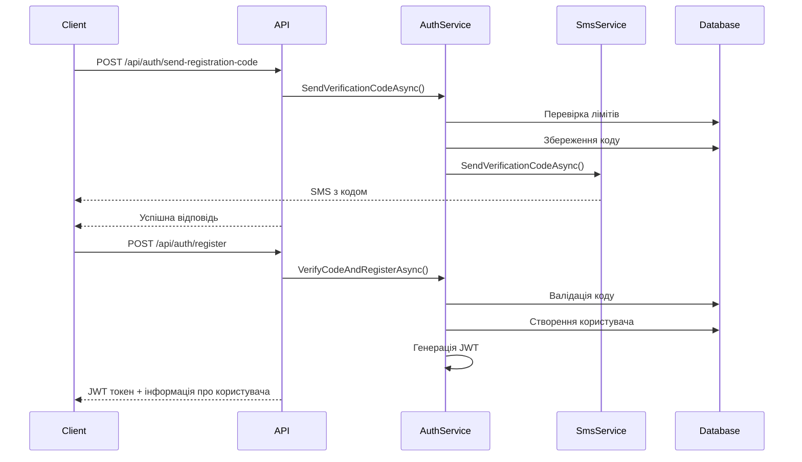
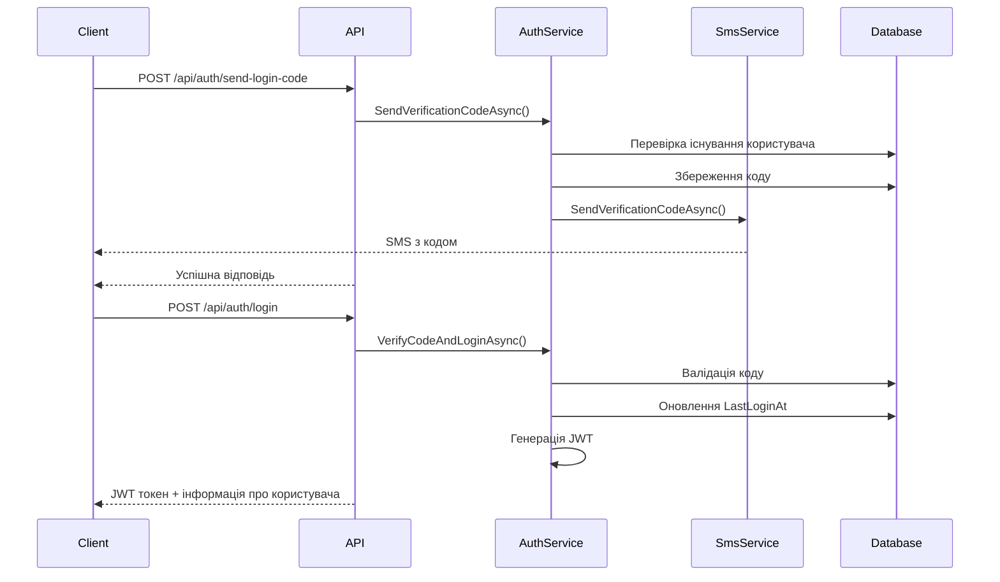

# Архітектура SMS Authentication API

## Огляд

Цей проект демонструє реалізацію аутентифікації через SMS з використанням найкращих практик ASP.NET Core, включаючи:

- **Minimal API** для легких та швидких endpoints
- **ASP.NET Core Identity** для управління користувачами
- **JWT токени** для авторизації
- **Entity Framework Core** для роботи з базою даних
- **Dependency Injection** для слабкого зв'язування компонентів

## Структура проекту

```
AspNet.MinimalApi.AuthSms/
├── Models/                     # Моделі даних
│   ├── ApplicationUser.cs      # Розширена модель користувача
│   └── SmsVerificationCode.cs  # Модель SMS кодів
├── DTOs/                       # Data Transfer Objects
│   └── AuthDtos.cs            # DTO для API запитів/відповідей
├── Data/                       # Рівень доступу до даних
│   └── ApplicationDbContext.cs # EF Core контекст
├── Services/                   # Бізнес логіка
│   ├── ISmsService.cs         # Інтерфейс SMS сервісу
│   ├── SmsService.cs          # Реалізація SMS сервісу
│   ├── IAuthService.cs        # Інтерфейс аутентифікації
│   └── AuthService.cs         # Логіка аутентифікації
├── Endpoints/                  # API endpoints
│   └── AuthEndpoints.cs       # Minimal API endpoints
├── Program.cs                  # Конфігурація додатку
├── appsettings.json           # Конфігурація
├── test-api.sh                # Тестовий скрипт
└── README.md                  # Документація
```

## Компоненти системи

### 1. Models (Моделі)

#### ApplicationUser
- Розширює `IdentityUser`
- Додає додаткові поля: `FirstName`, `LastName`, `CreatedAt`, `LastLoginAt`
- Підтримує підтвердження номера телефону

#### SmsVerificationCode
- Зберігає SMS коди верифікації
- Має термін дії (5 хвилин)
- Підтримує різні цілі: реєстрація, вхід, відновлення паролю
- Одноразове використання

### 2. Services (Сервіси)

#### ISmsService / SmsService
- Абстракція для відправки SMS
- В демо режимі логує коди в консоль
- Легко замінити на реальний провайдер (Twilio, AWS SNS)

#### IAuthService / AuthService
- Основна логіка аутентифікації
- Генерація та валідація SMS кодів
- Створення JWT токенів
- Управління користувачами через Identity

### 3. Data Layer (Рівень даних)

#### ApplicationDbContext
- Наслідує `IdentityDbContext<ApplicationUser>`
- Налаштовує індекси для оптимізації
- Конфігурує зв'язки між таблицями

### 4. API Layer (Рівень API)

#### AuthEndpoints
- Minimal API endpoints
- Валідація вхідних даних
- Обробка помилок
- Swagger документація

## Потік аутентифікації

### Реєстрація користувача



### Вхід користувача



## Безпека

### Реалізовані заходи

1. **SMS коди**
   - Термін дії: 5 хвилин
   - Одноразове використання
   - Випадкова генерація (6 цифр)

2. **Rate Limiting**
   - Максимум 3 SMS за 10 хвилин на номер
   - Автоматичне очищення старих кодів

3. **JWT токени**
   - Підпис HMAC SHA256
   - Термін дії: 60 хвилин (налаштовується)
   - Включають необхідні claims

4. **Валідація**
   - Валідація номерів телефонів
   - Валідація паролів через Identity
   - Валідація всіх вхідних даних

5. **Хешування паролів**
   - Використовується Identity для безпечного зберігання

### Рекомендації для production

1. **HTTPS** - обов'язково для production
2. **Реальна база даних** - PostgreSQL, SQL Server
3. **Redis** - для кешування та rate limiting
4. **Логування** - структуроване логування з Serilog
5. **Моніторинг** - Application Insights, Prometheus
6. **Refresh токени** - зберігання в базі даних
7. **CORS** - налаштування для конкретних доменів

## Розширення

### Інтеграція з реальними SMS провайдерами

```csharp
// Приклад для Twilio
public class TwilioSmsService : ISmsService
{
    private readonly TwilioRestClient _client;
    
    public async Task<bool> SendSmsAsync(string phoneNumber, string message)
    {
        var messageResource = await MessageResource.CreateAsync(
            body: message,
            from: new PhoneNumber(_twilioPhoneNumber),
            to: new PhoneNumber(phoneNumber)
        );
        
        return messageResource.Status != MessageResource.StatusEnum.Failed;
    }
}
```

### Додавання Redis для кешування

```csharp
services.AddStackExchangeRedisCache(options =>
{
    options.Configuration = connectionString;
});

services.AddScoped<ICacheService, RedisCacheService>();
```

### Додавання rate limiting

```csharp
services.AddRateLimiter(options =>
{
    options.AddFixedWindowLimiter("SmsPolicy", opt =>
    {
        opt.PermitLimit = 3;
        opt.Window = TimeSpan.FromMinutes(10);
    });
});
```

## Тестування

Проект включає:
- Автоматичний тестовий скрипт (`test-api.sh`)
- Postman колекцію
- Swagger UI для інтерактивного тестування
- Логування для відстеження операцій

## Висновок

Ця архітектура забезпечує:
- **Масштабованість** - легко додавати нові функції
- **Безпеку** - реалізовані основні заходи безпеки
- **Тестованість** - чітке розділення відповідальностей
- **Підтримуваність** - чистий код з хорошою документацією
- **Гнучкість** - легко замінити компоненти (SMS провайдер, база даних)
