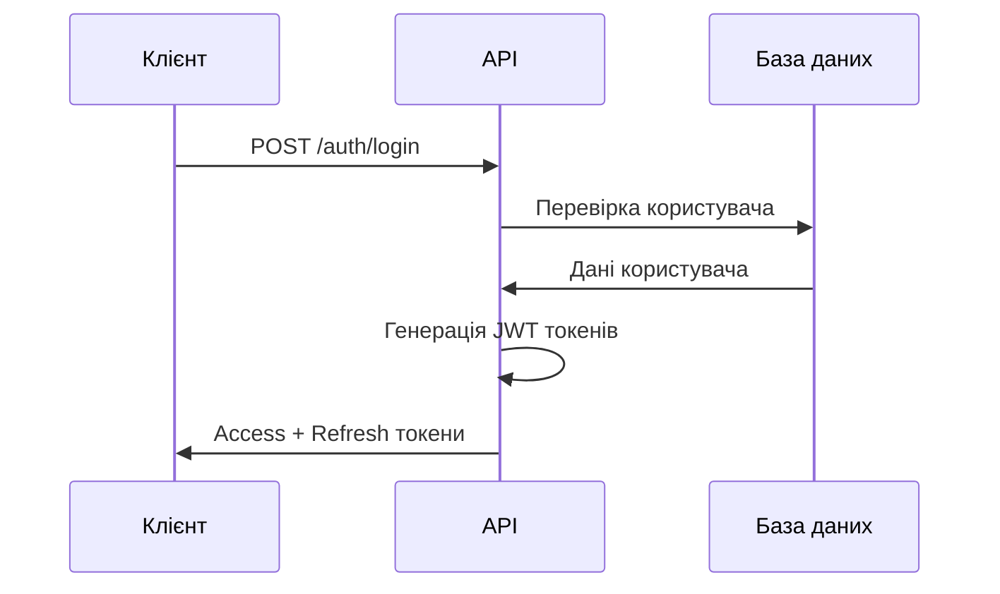
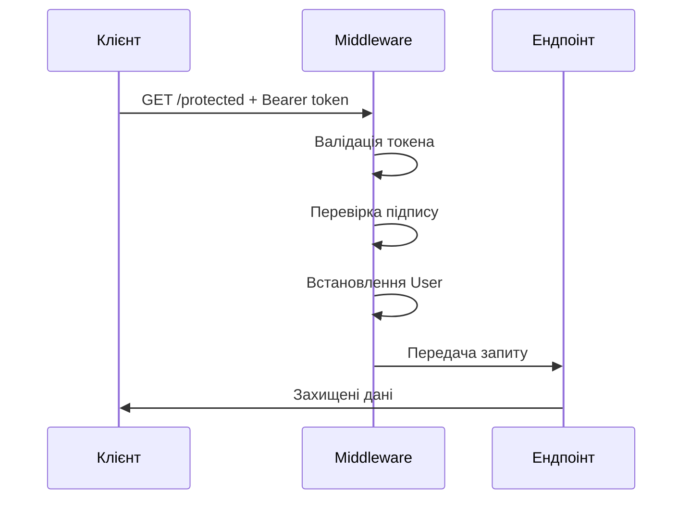

# 🎓 Посібник для студентів: Кастомна JWT аутентифікація

## 🎯 Що ви дізнаєтеся

Цей проект демонструє **повну кастомну реалізацію JWT аутентифікації** без використання готових бібліотек. Ви
зрозумієте:

- 🔐 Як працюють JWT токени "під капотом"
- 🔑 Як створювати та валідувати підписи токенів
- 🎫 Різницю між Access та Refresh токенами
- 🛡️ Як реалізувати middleware аутентифікації
- 👥 Як працює система ролей та авторизації

## 🏗️ Архітектура JWT

### Структура JWT токена

JWT токен складається з **трьох частин**, розділених крапками:

```
header.payload.signature
```

#### 1. Header (Заголовок)

```json
{
  "alg": "HS256",  // Алгоритм підпису
  "typ": "JWT"     // Тип токена
}
```

#### 2. Payload (Корисне навантаження)

```json
{
  "sub": "1",                    // Subject - ID користувача
  "username": "admin",           // Ім'я користувача
  "email": "admin@example.com",  // Email
  "role": "Admin",               // Роль
  "token_type": "access",        // Тип токена
  "iss": "MyApp",               // Issuer - хто видав токен
  "aud": "MyApp.Users",         // Audience - для кого токен
  "exp": 1640995200,            // Expiration - коли закінчується
  "iat": 1640991600,            // Issued At - коли видано
  "jti": "unique-id"            // JWT ID - унікальний ID токена
}
```

#### 3. Signature (Підпис)

```
HMACSHA256(
  base64UrlEncode(header) + "." + base64UrlEncode(payload),
  secret_key
)
```

## 🔍 Ключові компоненти

### 1. JwtTokenGenerator - Серце системи

````csharp
public string GenerateAccessToken(User user)
{
    var claims = CreateAccessTokenClaims(user);
    var expirationTime = DateTime.UtcNow.AddMinutes(_options.ExpirationMinutes);
    
    return GenerateToken(claims, expirationTime, JwtClaims.AccessTokenType);
}
````

**Що робить:**

- Створює claims (твердження) про користувача
- Генерує header та payload
- Створює HMAC SHA-256 підпис
- Кодує все в Base64URL формат

### 2. JwtAuthenticationMiddleware - Перевірка токенів

````csharp
public async Task InvokeAsync(HttpContext context)
{
    var token = ExtractTokenFromHeader(context);
    
    if (!string.IsNullOrEmpty(token))
    {
        var principal = _tokenGenerator.ValidateToken(token);
        if (principal != null && JwtTokenGenerator.IsAccessToken(principal))
        {
            context.User = principal;
            SetUserInfoInContext(context, principal);
        }
    }
    
    await _next(context);
}
````

</augment_code_snippet>

**Що робить:**

- Витягує токен з заголовка `Authorization: Bearer <token>`
- Валідує підпис токена
- Перевіряє термін дії
- Встановлює користувача в контекст

### 3. Система ролей

````csharp
app.MapGet("/admin/dashboard", (HttpContext context) =>
{
    if (!context.IsAuthenticated())
        return JwtAuthenticationExtensions.Unauthorized();
    
    if (!context.IsAdmin())
        return JwtAuthenticationExtensions.Forbidden("Доступ тільки для адміністраторів");
    
    return Results.Ok(new { Message = "Ласкаво просимо до адміністративної панелі!" });
});
````

## 🔐 Процес аутентифікації

### 1. Реєстрація/Вхід



### 2. Доступ до захищених ресурсів



## 🧪 Практичні завдання

### Завдання 1: Аналіз токена

1. Увійдіть як admin: `POST /auth/login`
2. Скопіюйте Access токен
3. Вставте його на https://jwt.io
4. Проаналізуйте header, payload та signature

### Завдання 2: Тестування безпеки

1. Спробуйте змінити payload токена
2. Спробуйте використати прострочений токен
3. Спробуйте доступ без токена
4. Спробуйте доступ з неправильною роллю

### Завдання 3: Розширення функціональності

1. Додайте нову роль "Moderator"
2. Створіть ендпоінт тільки для модераторів
3. Додайте claim "permissions" до токена

## 🔧 Як запустити та протестувати

### 1. Запуск додатку

```bash
cd AspNet.MinimalApi.CustomJwtAuth
dotnet run
```

### 2. Тестування через curl

```bash
# Вхід
curl -X POST http://localhost:5100/auth/login \
  -H "Content-Type: application/json" \
  -d '{"username": "admin", "password": "admin123"}'

# Захищений ресурс
curl http://localhost:5100/protected \
  -H "Authorization: Bearer YOUR_TOKEN_HERE"
```

### 3. Автоматичне тестування

```bash
./test-jwt-auth.sh
```

## 🆚 Порівняння з готовими рішеннями

| Аспект         | Наша реалізація                     | ASP.NET Core Identity        |
|----------------|-------------------------------------|------------------------------|
| **Контроль**   | Повний контроль над кожним аспектом | Обмежений готовими рішеннями |
| **Розуміння**  | Глибоке розуміння JWT               | Поверхневе розуміння         |
| **Гнучкість**  | Можна змінити будь-що               | Складно кастомізувати        |
| **Складність** | Потрібно реалізувати все самому     | Готове "з коробки"           |
| **Навчання**   | Відмінно для навчання               | Погано для розуміння основ   |

## 🔒 Безпека в продакшені

⚠️ **Наша реалізація для навчання!** В продакшені потрібно:

1. **Зовнішнє зберігання секретів**
   ```csharp
   // Замість appsettings.json
   var secretKey = Environment.GetEnvironmentVariable("JWT_SECRET");
   ```

2. **HTTPS для всіх запитів**
   ```csharp
   app.UseHttpsRedirection();
   ```

3. **Rate limiting**
   ```csharp
   app.UseRateLimiter();
   ```

4. **Відкликання токенів**
   ```csharp
   // Blacklist для відкликаних токенів
   var isBlacklisted = await _tokenBlacklistService.IsBlacklistedAsync(token);
   ```

## 📚 Додаткові ресурси

- [RFC 7519 - JSON Web Token](https://tools.ietf.org/html/rfc7519)
- [JWT.io - Debugger](https://jwt.io/)
- [OWASP JWT Security](https://cheatsheetseries.owasp.org/cheatsheets/JSON_Web_Token_for_Java_Cheat_Sheet.html)

## 🎯 Висновки

Після вивчення цього проекту ви:

✅ Розумієте структуру JWT токенів  
✅ Знаєте, як створювати та валідувати підписи  
✅ Можете реалізувати власну систему аутентифікації  
✅ Розумієте переваги та недоліки різних підходів  
✅ Готові використовувати готові рішення усвідомлено

**Головне:** Тепер ви знаєте, що відбувається "під капотом" JWT аутентифікації! 🚀
